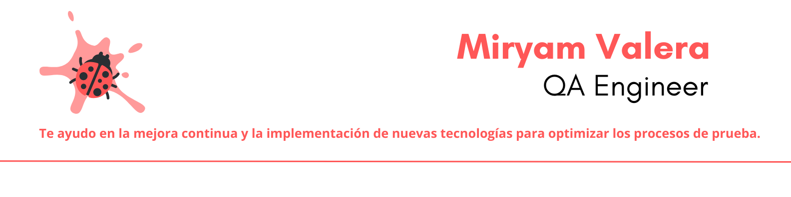

   

# ¡Hola a todos! ✨Bienvenid@s a mi repositorio de HitHub✨<h3>No soy un robot, soy una ***QA Engineer*** apasionada por la automatización de pruebas y la integración continua.</h3>

    

### Tecnologías 

